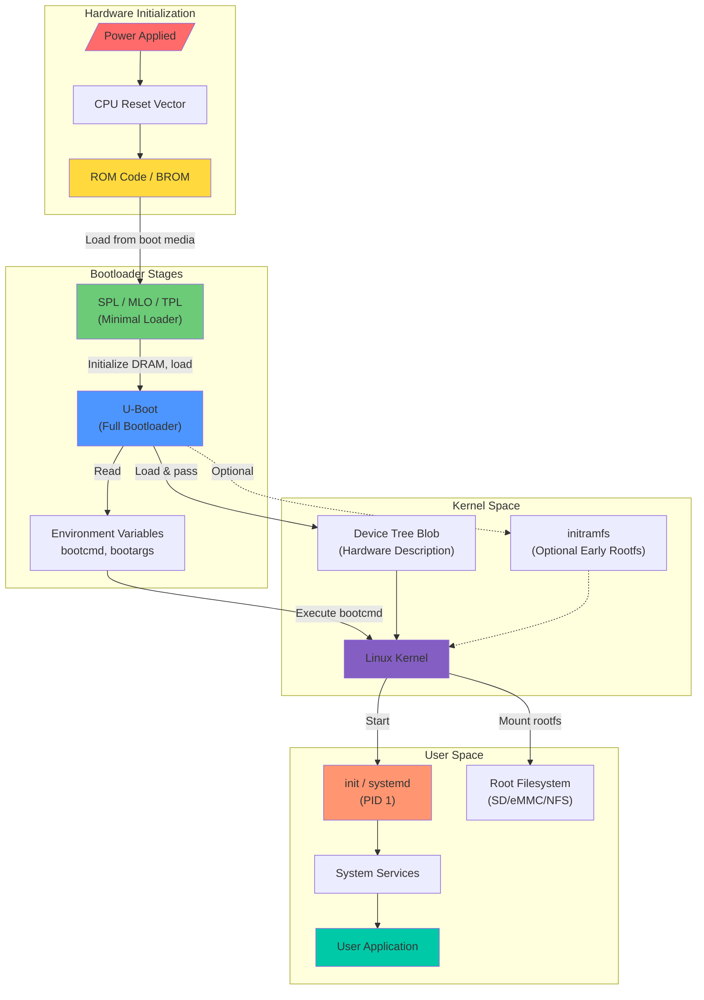
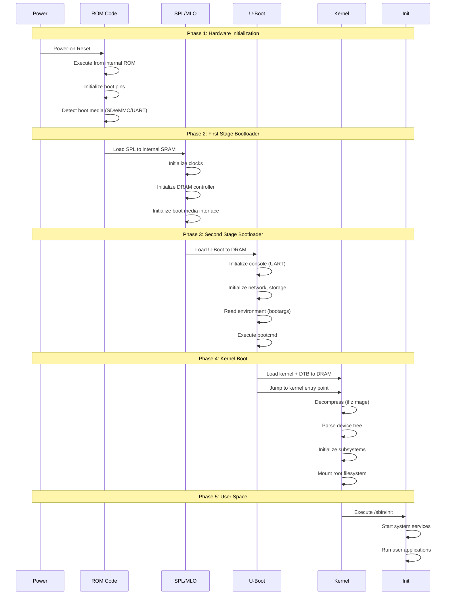
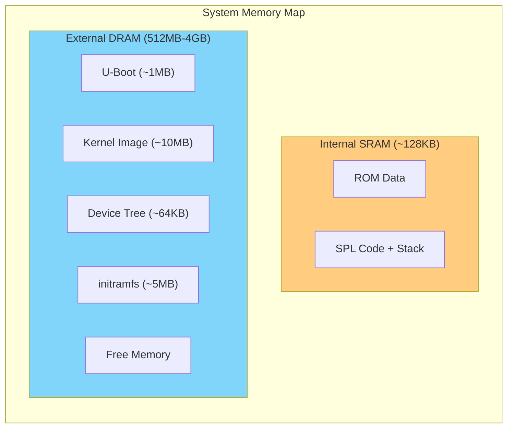
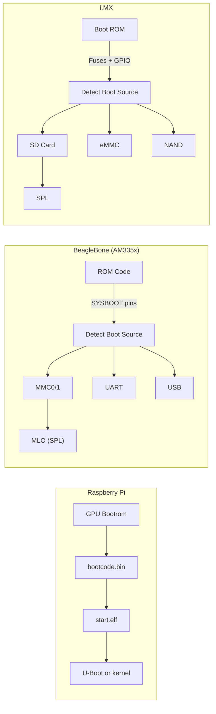
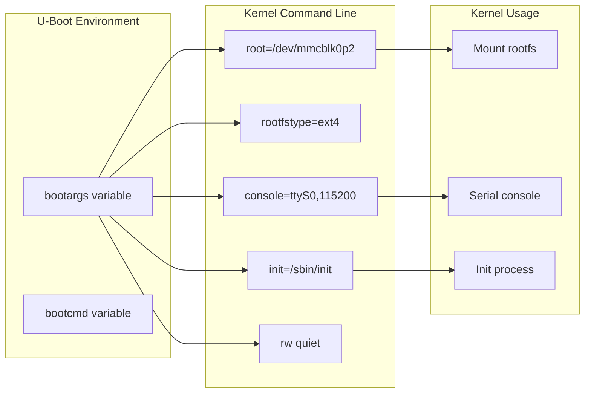

# Embedded Linux Boot Flow Diagram

This document provides visual representations of the complete Embedded Linux boot sequence from power-on to user space.

## Why Understanding Boot Flow Matters

In embedded systems, understanding the boot flow is critical because:

1. **Debugging**: When a system fails to boot, you need to identify which stage failed
2. **Optimization**: Boot time requirements often require optimizing specific stages
3. **Security**: Secure boot chains require understanding each verification step
4. **Customization**: Adding features often requires modifications at specific boot stages
5. **Recovery**: Implementing recovery mechanisms requires knowledge of fallback points

## Complete Boot Flow Overview

## Detailed Stage Breakdown

## Memory Layout During Boot

## Boot Media Detection (Platform Specific)

## Boot Arguments Flow

## Typical Boot Times

| Stage | Typical Duration | Can Be Optimized |
|-------|-----------------|------------------|
| ROM Code | 10-50 ms | No (fixed) |
| SPL | 50-200 ms | Limited |
| U-Boot | 1-3 seconds | Yes |
| Kernel | 1-5 seconds | Yes |
| Init/Systemd | 2-10 seconds | Yes |
| **Total** | **4-20 seconds** | **Yes** |

## What You Learned

After studying this diagram:
- You understand the complete boot sequence from power-on to user application
- You can identify which component is responsible for each boot stage
- You understand the memory transitions (ROM → SRAM → DRAM)
- You can trace how bootargs flow from U-Boot to kernel
- You understand platform-specific boot variations
